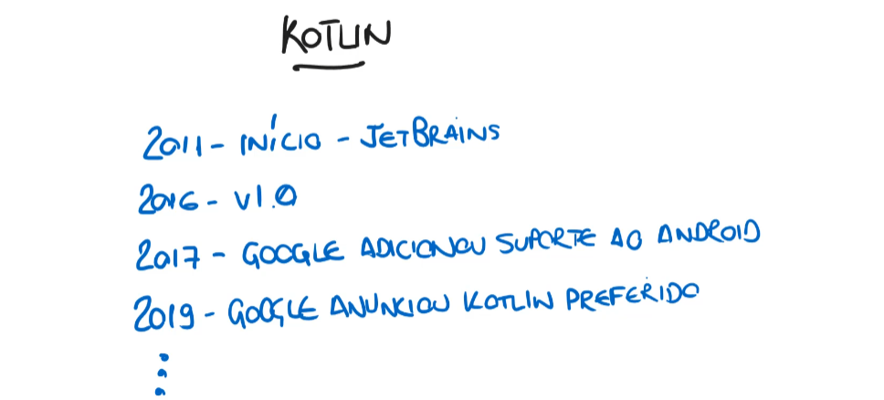

# History

- It all started in 2011 with the company JetBrains. (Beginning)
   - JetBrains is the same company that developed IntelliJ (with 100% support for Kotlin).

- In 2016, version 1.0 was released.

- In 2017, Google added official support for Android development using Kotlin.

- In addition to Java, it became possible to use Kotlin.
  - In 2019, Google announced that Kotlin had become the preferred language for Android development.

  - **Kotlin > Java** (which means it's recent compared to the timeline of these notes here on GitHub Issues);
...

...

...

Today, Kotlin is increasingly gaining ground in the backend world.

;